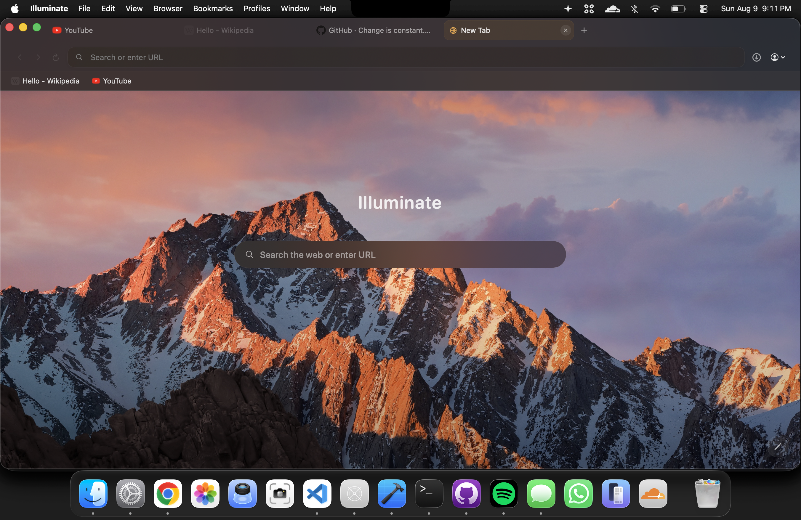
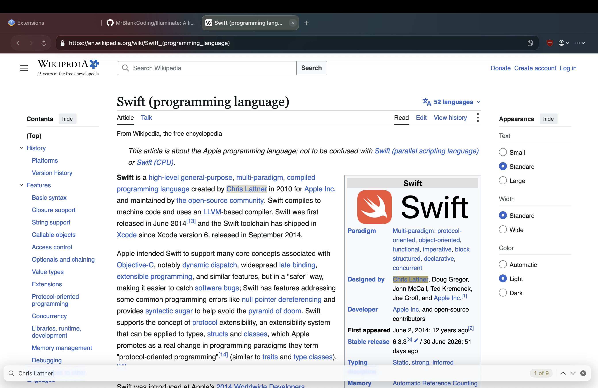

# Illuminate

A lightweight browser built for MacOS that uses webkit and includes no arbitrary features or user tracking.


## Features

* WebKit-based browsing
* Isolated profiles and Guest mode
* Download manager
* Ad and tracker blocking
* Tab groups, caching, and previews
* Bookmarks and shortcuts
* Cookie management
* History system

## Privacy

Illuminate is designed with privacy in mind:

* No tracking
* No telemetry or user analytics
* No account required
* Tracker blocking
* Cookie management
* Canvas fingerprinting protection

## Screenshots




## Requirements

* macOS 26 (Tahoe) or later
* Xcode 26 or later
* Swift 6

## Build

```bash
xcodebuild -project Illuminate.xcodeproj \
  -scheme Illuminate \
  -configuration Debug \
  -destination 'platform=macOS' build
```

## Packages Used

* [Nuke](https://github.com/kean/Nuke) — image loading, caching and favicon pipeline for native browser UI
* [Fabric.js](https://github.com/fabricjs/fabric.js) — canvas engine for Illuminate Easel whiteboard (offline, local `WKWebView`)


## Features to implement

* [ ] Add redirect blocking
* [ ] Increase test coverage beyond 75%
* [ ] Performance optimizations
* [ ] Expand extension support
* [ ] KeychainAccess for password management
* [ ] Write an actual onboarding view instead of AI 
* [ ] Make it so you can split panes for browser windows ;) -> didnt think I would need this but now it seems helpful 
* [ ] Localise app 
* [ ] Widget??


## Known Issues
* [ ] Cannot drag and drop tabs into groups that exist (UI)
* [ ] Not a bug but a nicer font could be more readable and pretty
* [ ] Closing a tab causes the webview to go black when it auto swiches to the next tab
* [ ] Search suggestions dont show at all

## Contributing
If you'd like to report a bug, please do under issues

Illuminate is open-source for a reason, and any contributions from anyone is welcome! 

## AI Disclosure

AI tools were used during development to assist with implementation and code generation. Generated code was reviewed, tested, and integrated responsibly.

## Acknowledgments

* [Nuke](https://github.com/kean/Nuke) by Alexander Grebenyuk — image pipeline
* [Fabric.js](https://github.com/fabricjs/fabric.js) — whiteboard canvas engine


## License

MIT. See [LICENSE](LICENSE).
