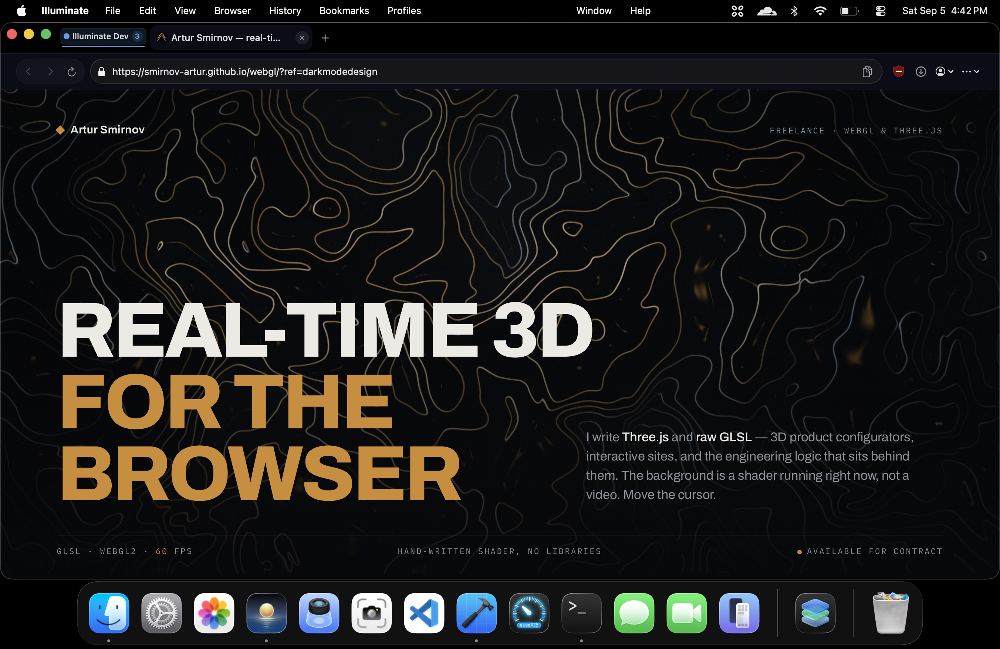

# Illuminate

### A lightweight modern browser built for MacOS 

## About 

A lightweight browser built for MacOS that uses webkit and includes no arbitrary features or user tracking. Illuminate is still in development, although since its only me, bug fixes will be slow. 

## Features

* WebKit-based browsing
* Isolated profiles and Guest mode
* Download manager
* Ad and tracker blocking
* Tab groups, caching, and previews
* Bookmarks and shortcuts
* Cookie management
* History system

## Privacy

Illuminate is designed with privacy in mind:

* No tracking
* No telemetry or user analytics
* No account required
* Tracker blocking
* Cookie management
* Canvas fingerprinting protection

## Screenshots

## Requirements

* macOS 26 (Tahoe) or later
* Xcode 26 or later
* Swift 6

## Packages Used

* [Nuke](https://github.com/kean/Nuke) — image loading, caching and favicon pipeline for native browser UI

## Features to implement

* [ ] Add redirect blocking
* [ ] Increase test coverage beyond 75%
* [ ] Performance optimizations
* [ ] Expand extension support
* [ ] KeychainAccess for password management
* [ ] Write an actual onboarding view instead of AI 
* [ ] Localise app 
* [ ] Open picture in picture auto
* [ ] Warn before quitting?
* [ ] Sync passwords with apple passwords
* [ ] Command Shift T to open closed tab
* [ ] Toast Notifcation for certain things (Copying tab URL CTR shift C)

## Known Issues
* [ ] Cannot drag and drop tabs into groups that exist (UI)
* [ ] Not a bug but a nicer font could be more readable and pretty
* [ ] Closing a tab causes the webview to go black when it auto swiches to the next tab
* [ ] Search suggestions dont show at all
* [ ] When too many tabs are open tab group title isnt shown
* [ ] Extracted background color needs a cap on how bright it can be
* [ ] Issues with staying signed in (Could be for memory dumping)

## Contributing
If you'd like to report a bug, please do under issues

Illuminate is open-source for a reason, and any contributions from anyone is welcome! 

## AI Disclosure

AI tools were used during development to assist with implementation and code generation. Generated code was reviewed, tested, and integrated responsibly.

## Acknowledgments

* [Nuke](https://github.com/kean/Nuke) by Alexander Grebenyuk — image pipeline

## License

MIT. See [LICENSE](LICENSE).
